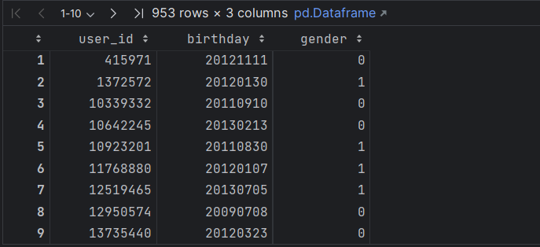
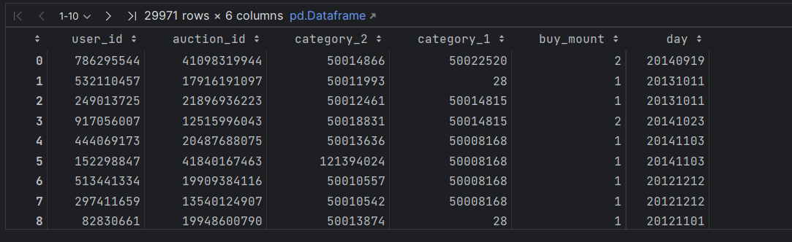

## 数据挖掘导论大作业开题报告

#### 选题

本次课程综合实验的选题为“淘宝母婴购物数据可视化分析”，本题为天池大数据竞赛学习赛的一道选题（[淘宝母婴购物数据可视化分析_学习赛_天池大赛-阿里云天池 (aliyun.com)](https://tianchi.aliyun.com/competition/entrance/532082/introduction)）。

#### 背景介绍

> 该背景介绍部分摘自天池竞赛赛事网页

母婴用品是淘宝的热门购物类目，随着国家鼓励二胎、三胎政策的推进，会进一步促进了母婴类目商品的销量。与此年轻一代父母的育儿观念也发生了较大的变化，因此中国母婴电商市场发展形态也越来越多样化。随之引起各大母婴品牌更加激烈的争夺，越来越多的母婴品牌管窥到行业潜在的商机，纷纷加入母婴电商，行业竞争越来越激烈。

本次课程综合实验将基于“淘宝母婴购物数据”进行分析。

#### 数据集介绍

本次学习赛提供了两个数据集，分别为“tianchi_mum_baby_trade_history.csv” 和 “tianchi_mum_baby.csv“，两个数据集分别包含不同信息：

|                  数据集                  | 内容    |
|:-------------------------------------:|-------|
| 'tianchi_mum_baby_trade_history.csv'  | 购物行为表 |
|        'tianchi_mum_baby.csv'         | 母婴信息表 |

每个数据集中的数据及特征值分别如下：

###### 母婴信息表（'tianchi_mum_baby.csv'）：

|    字段    |        字段说明        |
|:--------:|:------------------:|
| user_id  |        用户id        |
| birthday |       出生年月日        |
|  gender  | 性别(0-男孩 1-女孩 2-不明) |

###### 购物行为表（'tianchi_mum_baby.csv'）：

|     字段     |   字段说明    |
|:----------:|:---------:|
|  user_id   |   用户id    |
| auction_id |   交易id    |
| category_1 |  商品一级目录   |
| category_2 |  商品二级目录   |
| buy_mount  |   购买数量    |
|    day     | 交易时间（年月日） |

#### 环境
本次实验使用的python环境为之前几次实验中用anaconda新搭建的环境'newConda'，python版本为3.8，已经安装了之前实验中使用到的各种基本packages，在本次实验中预计将安装聚类、分类、频繁模式挖掘相关的官方库以调用进行处理。

实验中.ipynb文件使用DataSpell 2023.1.2进行编写和运行。

